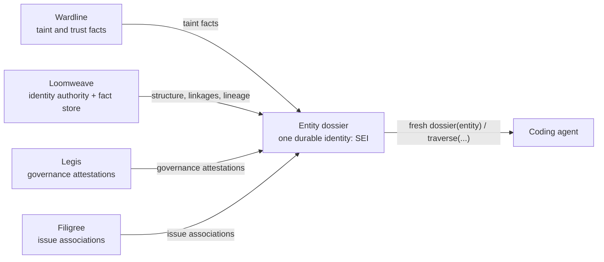
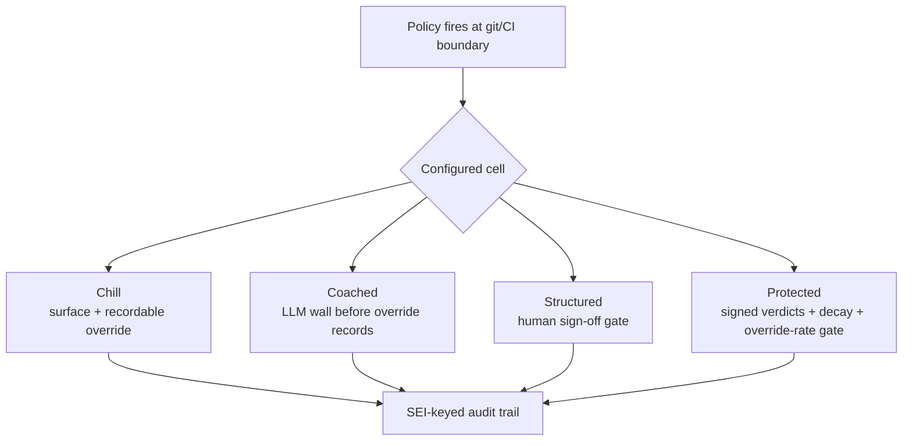

# Legis

Legis is the fourth Weft product: the git/CI and governance side of the suite's common operating picture.

> The authoritative Weft federation roster and axiom live in the hub at `~/weft/doctrine.md`. This README does not independently restate the roster; Legis's "fourth Weft product" framing is its own self-description, consistent with the hub's ruling (Legis is a realized member). See `~/weft/members/legis.md` for Legis's thin briefing.

## Status

Legis is at **`1.0.0`** — the gold release. The standalone git/CI surfaces, the graded 2x2 enforcement engine, the agent-programmable policy grammar, SEI-keyed attestations, and the Wardline/Filigree suite combinations are built and tested. The git-rename provider to Loomweave is contract-locked, operative pending Loomweave's committed-range driving.

The transport-agnostic service layer (WP-M1) and the agent-facing MCP surface on top of it have landed (`legis mcp`). The MCP surface now declares output schemas across its tools, exposes read-side governance/diagnostic tools (`doctor_get`, `override_list`, `policy_boundary_check`, lineage-honesty reads, `check_report`, `signoff_bind_issue`), and keeps the API/MCP/CLI paths routed through the same service layer instead of duplicating governance decisions.

Legis stands itself up with `legis install`: instruction block, `legis-workflow` skill pack, SessionStart hook, `.mcp.json` registration, and the Legis-only `.weft/legis/` ignore rule. `legis doctor [--fix]` provides an operator health view and safe repair for the install + config layer, tagging each problem `[auto-fixable]` or `[operator]` so it is clear what `--fix` will and will not touch. Doctor names enablement paths when governance is unwired (policy cells, Wardline routing), but it reports rather than auto-enabling policy surfaces or touching signing keys.

Gold was earned, not declared: 1.0.0 was first cut on 2026-06-09, then re-opened when a P0 governance-honesty false-green (G1 — an absent Wardline `findings` key routing zero defects under a green status) was caught *after* the cut. The fix, the cross-member conformance vector that makes it real, and a small batch of follow-through hardening shipped before final. See the combination matrix below for per-pairing status and `CHANGELOG.md` for the full release notes.

### Last week in practical terms

The last week moved Legis from "feature-complete release candidate" to "operationally hardened gold":

- **Release and conformance.** PyPI publishing is gated on live Loomweave SEI conformance with required `LOOMWEAVE_URL`, `LOOMWEAVE_LIVE_ORACLE_LOCATOR`, and `LEGIS_LOOMWEAVE_HMAC_KEY`; optional CI-only skips no longer decide release integrity.
- **Doctor and install hardening.** Doctor validates `.mcp.json` as an executable Legis stdio server, rejects repo-local SessionStart hooks, handles missing roots without crashing, and keeps audit-chain checks report-only instead of initializing truncated stores. Instruction refresh compares the whole owned block to the packaged block, not just the marker token.
- **Governance honesty.** Wardline dirty unsigned artifacts no longer return transport success when nothing was governed; malformed or missing scan fields fail as malformed input rather than routing zero findings under green. Policy-boundary evidence fingerprints now include semantic decorators such as `pytest.mark.skip`, `parametrize`, and wrapper decorators.
- **Configuration custody.** Repo `weft.toml` can no longer redirect Legis governance stores; explicit `LEGIS_*_DB` environment variables are the relocation mechanism. The root `.gitignore` ignores only `.weft/legis/`, not the whole shared `.weft/` namespace.
- **Transport custody.** Loomweave request signing sends the exact canonical bytes it signs and rejects redirects before `X-Weft-*` HMAC headers can leak. Filigree binds intentionally send no `X-Weft-*` transport HMAC headers; the app-level `binding_signature` remains the governance evidence in the JSON body. Loomweave/Filigree remote plaintext remains a dev-only escape hatch that voids response-integrity custody.

## The Weft suite

> Federation roster and axiom are authoritative in the hub at `~/weft/doctrine.md`. The framing below describes the substrate from Legis's vantage point and is not the canonical roster — consult the hub for that.

Weft is a suite of four tools that share a single substrate: a codebase modelled as **entities**, each carrying typed facts from different tools, all keyed on one durable identity, all freshness-honest, all consumable in one call.

**Goal state:** a coding agent can ask *"what is true of this function, and what should I do about it?"* and get a complete, current, cited answer — and that answer stays correct when the function is renamed tomorrow.

### Operating model

One root invariant generates the entire stack:

> **Agent-first: humans on the loop, not in the loop.** The agent *operates and extends* the environment; the human *supervises, approves, and governs* from outside the operating cycle.

Consequences:

- **Zero *human* config.** Each tool stands itself up preloaded with agent-calibrated instructions — the instruction layer *is* the configuration mechanism.
- **Agent-programmable extension.** Agents can define new boundary types and the rules enforced at them, expressed in a shared grammar with builtins as preloaded defaults.
- **Legis graded enforcement.** When a policy fires, its mode decides who answers: **block + escalate** (the human operator signs off — in the loop by exception) or **surface + override** (the agent must *recordably* override, and the human reviews the trail asynchronously). The recorded override is what makes "humans not in the loop" safe: an attributable audit event, never a silent pass.

### The combination matrix

Weft's value is the *matrix* of its tools' combinations, not their sum. Each pair is an opt-in layer that lights up a capability neither tool has alone:

| Combination | Capability | Status |
|---|---|---|
| **Wardline + Loomweave** | Structure + trust posture in one view (the dossier) | **Live** |
| **Wardline + Filigree** | Findings become tracked work | **Live** |
| **Loomweave + Filigree** | Issues bound to live code, surviving refactors | **Partial** — orphans on rename (SEI gap) |
| **Wardline + Legis** | Agent-defined policy enforced at the CI/git boundary | **Live** — findings route through legis enforcement into the configured 2×2 cell (Sprint 6 WP-6.1) |
| **Loomweave + Legis** | Governance attestations keyed to stable code identity | **Live** (SEI-keyed attestations, Sprint 5); git-rename provider **contract-locked**, operative pending Loomweave committed-range driving (WP-6.3) |
| **Filigree + Legis** | Governed issue lifecycle — sign-offs, RTM, verification states | **Live** — governed SEI-keyed sign-off binding; Filigree retains lifecycle authority (Sprint 6 WP-6.2) |

Higher-order: **all four** closes the loop — the agent understands the code (Loomweave) and its trust posture (Wardline), Legis governs what it may do and records overrides, and every decision and unit of work is tracked against stable identity (Filigree + Loomweave).

SEI is the connective tissue of the whole matrix: one non-conformant binding orphans every combination it participates in.

## What Legis is

Legis is the Weft authority for:

- project change provenance,
- branch / commit / pull request context,
- CI and check context, and
- governance and attestation context over change.

Legis answers: *what changed, in which branch/commit/PR/check context, and what governance or attestation state exists for that change?*

### The governance 2×2

Legis's enforcement surface is a **2×2**, and the base always stays weightless. Two independent axes: how much governance *structure* you want (simple / complex), and whether an LLM *judge* sits inline (off / on). Each axis is agent-set; every cell is genuinely useful.

|  | **Judge OFF** | **Judge ON** |
|---|---|---|
| **Simple** | **Chill** — CI flags the violation; the agent self-reports a recordable override; the human reviews the trail asynchronously. No LLM, no crypto, no ceremony. | **Coached** — same flow, but the agent pushes against an interactive LLM wall *before* the override records. One config flag. |
| **Complex** | **Structured** — block + escalate; a designated human signs off before the gate clears. Procedural gates, no model in the critical path. | **Protected** — the full machinery: HMAC-signed verdicts, decay sweep, override-rate gate. |

**Chill (simple, judge off).** Legis is invisible until you want it. No judge, no required attestations, no configuration burden. When a policy fires at the CI/git boundary, the agent has a choice: refactor, or make a *recordable override* — an attributable audit event the human reviews from the loop's edge, asynchronously. The trail exists; the human is not blocked. A solo project that never switches Legis on pays nothing.

**Coached (simple, judge on) — the config-flag cell.** The same flow, but an LLM judge evaluates the proposed override *before* it records. This is the casual coder's interactive wall: CI pushes back on a policy-breaking change until the agent corrects the code or explains itself convincingly. Verdicts are `ACCEPTED` or `BLOCKED`; a blocked agent must correct or sharpen its rationale and re-submit — it cannot self-clear past the judge. **A single config flag** — no HMAC key management, no decay sweep, no deployment ceremony. It raises the cost of lazy overrides without raising the cost of honest ones. There is no operator override here; for that authority, upgrade to complex.

**Structured (complex, judge off).** Block + escalate without an LLM in the loop: for high-stakes policies, a designated human operator must sign off before the gate clears. Clear procedural governance with explicit human authority — for teams that want hard gates but no model in the critical path. The human is in the loop by exception, not by default.

**Protected (complex, judge on) — the full machinery.** When both dials are up, Legis adds the cryptographic layer over the coached cell:

- **LLM judge gate** on every new suppression/attestation, now returning `ACCEPTED`, `BLOCKED`, or `OVERRIDDEN_BY_OPERATOR`. The judge *blocks but does not fix* — a BLOCKED verdict returns the failure to the agent; the agent figures out remediation. The judge's rationale is recorded verbatim as audit evidence, bound to the source bytes and AST node it inspected (`file_fingerprint` + `ast_path`), and HMAC-signed so tamper-attempts are detectable.
- **Decay sweep.** At renewal time, existing suppressions re-run through the judge. Decisions to keep an entry must survive a fresh judge pass. Closes the "self-attested, never re-reviewed" failure mode.
- **Override-rate gate.** A rolling-window threshold on the ratio of `OVERRIDDEN_BY_OPERATOR` verdicts. Too many overrides is itself an audit signal — either the policy is miscalibrated, or the operator is breaking their own rules to ship. Either way, it is observable rather than silent.
- **Block + escalate** is also available here, with the added constraint that even a human sign-off produces a tamper-bound record.
- **Audit lineage keyed on SEI.** Every verdict, override, and sign-off is recorded in an append-only trail keyed on Stable Entity Identity so the record survives rename/move.

> **What "cryptographic layer" means here.** The HMAC signing is intra-suite *tamper-evidence* — it binds a governance record to SEI-stable code identity and detects after-the-fact edits by an actor who cannot recompute the keyed signature (e.g. a holder of raw DB-file access). The recorded actor is *self-asserted* (not a third-party-authenticated identity), and verification today is same-process Python over v1 canonical JSON. It is **not** a third-party-verifiable, cross-party authenticated cryptographic proof. RFC-8785 canonicalization is the named one-file upgrade for the day a non-Python verifier of a Legis attestation lands.

The elspeth CI judge (`/home/john/elspeth`) is the working design ancestor of the protected cell — it is the "thick version" shipped inside elspeth's own codebase. Legis is where the same mechanisms land as a suite-level, opt-in layer.

### Known security limitations

Legis is a governance-*honesty* tool, so it states its own residual limits plainly rather than leaving them in source comments:

- **The coached cell is a model-robustness wall, not a cryptographic one.** A blocked agent clears the coached gate by convincing the LLM judge; a *malicious prompt injection* that persuades the model will likewise clear it. Structural injection (forging a verdict key) is closed and any transport/parse failure is fail-closed to `BLOCKED`, but the coached cell has no defense-in-depth against a model that is genuinely fooled. For verdicts that must not rest on the model's word, use the **protected** cell, where a judge `ACCEPTED` is advisory only and is downgraded to require operator sign-off (unless a deterministic, non-LLM validator confirms it).
- **Tamper-evidence assumes the signing key is out of the attacker's reach, and is not absolute against raw DB-file writes.** v3 signing binds each record's chain position, so in-place edits, reordering, and renumbering are detected. A holder of raw write access to the governance `.db` can still *delete* a record and re-chain, or rewrite a record's policy to a non-protected value and strip its protected markers ("modify-to-unsigned"), or truncate the tail — these are residuals of the conceded raw-file-write threat tier. The opt-in `HeadAnchor` mitigates truncation/rewind (with a documented anchor-replay caveat). `legis doctor` now refuses to bless zero-byte or missing-schema audit stores without creating replacement tables, but that is an operator diagnostic, not a substitute for storage custody. Keep the governance store on storage only the operator controls.
- **Durability tier.** The audit store runs `synchronous=FULL`, but a power loss can still drop the most recent un-checkpointed appends; the trail stays internally consistent (a shortened-but-valid tail), it does not corrupt.
- **SEI binding integrity rests on TLS by design.** The Weft request HMAC authenticates legis's *requests* to Loomweave; it does not sign Loomweave's *responses*. Filigree binds are transport-open and rely on TLS plus the app-level `binding_signature` and local `BindingLedger` evidence, not on `X-Weft-*` headers. `LEGIS_ALLOW_INSECURE_REMOTE_HTTP=1` still permits plaintext to a remote sibling and therefore **voids that custody seal** (an on-path attacker could forge a stable identity binding) — it logs a warning and is for dev/loopback use only.

**The full adversarial threat model is published — attack recipes and all.** Legis holds itself to the honesty bar it enforces, so both pre-1.0 adversarial reviews ship in the open, including the *reproduced* attack recipes for every residual above:

- [`docs/release-1.0-risk-audit.md`](docs/release-1.0-risk-audit.md) — the multi-lane pre-release risk audit.
- [`docs/release-1.0-pre-ship-review.md`](docs/release-1.0-pre-ship-review.md) — the independent second pass that re-attacked the audit's own fixes (and caught a real fail-open the self-verified pass had missed).

This is deliberate. Legis is a *"forced me to do the right thing"* discipline, not a hardened security boundary — its worth is the effort the threat model forces and the residual tiers it names honestly (raw DB-file write, model-robustness, response-integrity-rests-on-TLS), not a claim to withstand an attacker who already holds those capabilities. **The system is only as load-bearing as the effort put into it.**

### Graded enforcement

Across all four cells, one underlying primitive: when a policy fires, the *cell* decides who answers and what is recorded.

- **Surface + override** — agent may proceed, but makes a recordable override (with, in the coached/protected cells, a judge inline before it records). Human reviews the trail asynchronously. This is the simple tier's active state and the default for any policy that does not require a human gate.
- **Block + escalate** — hard gate; a designated human operator must sign off before the gate clears. The complex tier; used for high-stakes decisions.

Every cell produces an append-only audit trail keyed on SEI, so the record survives refactors.

## What Legis is not

Legis is not:

- a federation registry,
- a hidden suite runtime,
- a replacement for Loomweave's code identity authority,
- a replacement for Filigree's workflow authority, or
- a replacement for Wardline's policy analysis authority.

## How Legis fits into Weft

### Loomweave

Loomweave remains the sole authority for code identity and structure, including SEI. Legis is an SEI *consumer* (governance attestations key on SEI; SEI lineage is Legis's audit spine). Legis is also a git-signal provider: the git interface and rename feed are built and contract-locked for Loomweave's SEI matcher, but operative use still depends on Loomweave driving a committed rev-range. That does not move identity authority out of Loomweave.

### Filigree

Filigree remains the authority for issue and workflow state. Legis adds branch, commit, pull request, and check context around that work, and governs the issue lifecycle through verification sign-offs and requirement traceability — without taking over issue state or work-claim semantics.

### Wardline

Wardline remains the authority for policy findings, taint facts, and dossier truth. Legis contributes the git/CI context that Wardline cites when attaching findings or enforcement gates to real repository state, and adds governed enforcement modes on top of Wardline's analysis.

The division of responsibility is explicit: **Wardline analyses trust; Legis governs it — one judge, not two.** Wardline already has the gate primitive (`--fail-on`, exit codes); Legis adds the governed policy layer around it. This is Wardline's Milestone 5 (governance & trust-vocabulary convergence) from its roadmap — Wardline's half is thin and ready; the gate is Legis existing.

With Legis live, the Wardline + Legis combination unlocks:
- agent-defined policy, enforced at the git/CI boundary with graded modes;
- trust-vocabulary convergence — one `@trust_boundary` grammar across the suite, delivering elspeth's custody and fabrication-test guarantees in Weft's own terms, not a second naming scheme bolted on beside the first; and
- the full chill → coached → protected progression across the 2×2, with Wardline's findings as the input and Legis's enforcement layer as the output.

## Stable Entity Identity

Legis is an SEI **consumer**, not an authority.

- Loomweave mints, persists, re-binds, and resolves SEI.
- Legis treats SEI as opaque: never derived, parsed, or reinterpreted.
- Governance attestations key on **SEI** when the subject is a code entity, so attestations survive rename/move.
- SEI lineage (the append-only event log Loomweave maintains) is Legis's ready-made, tamper-evidence-able audit trail.
- If Loomweave does not advertise the `sei` capability, Legis degrades honestly rather than guessing.

See `docs/federation/sei-conformance.md` for Legis's specific conformance obligations.

## Goal-state checklist (Legis's contribution)

Legis is complete when:

- [x] Legis ships as opt-in: invisible to a solo project, complete for a regulated one — all four 2×2 cells work end-to-end
- [x] Governance attestations key on SEI and survive rename/move
- [x] `lineage(sei)` is consumed as the audit spine for governance records
- [x] Chill cell (simple, judge off): surface+override is live; agent overrides produce attributable audit events; human reviews async
- [x] Coached cell (simple, judge on): LLM wall on overrides behind a single config flag (ACCEPTED / BLOCKED); no HMAC keys, no decay sweep; agent must correct or convince
- [x] Protected cell (complex, judge on): judge gate adds OVERRIDDEN_BY_OPERATOR; verdicts HMAC-signed and SEI-keyed; decay sweep and override-rate gate wired into CI
- [x] Structured cell (complex, judge off): human sign-off gate available for high-stakes policies, no model in the critical path
- [x] Wardline + Legis: Wardline's `--fail-on` / exit codes governed by Legis's policy layer; trust-vocabulary converged to one grammar across the suite
- [x] Legis governs trust while Wardline analyses it — one judge, not two
- [x] Filigree + Legis: verification sign-offs and governed issue lifecycle work end-to-end
- [ ] Git-rename / history signal available for Loomweave's SEI matcher — the git interface and rename-feed are **built and contract-locked**; operative once Loomweave drives a committed rev-range (the one cross-tool gate that remains)

## Repository layout

- `docs/guide/` — operator guides: configuration reference and output interpretation
- `docs/federation/` — Weft-facing contracts and participation notes
- `docs/design/` — product intent and design notes
- `docs/superpowers/specs/` — approved design specs
- `docs/superpowers/plans/` — implementation plans

## Documents

**Operator guides (how to configure and read Legis):**
- `docs/guide/configuration.md` — what to set, what each cell costs to enable, the full env-var/flag reference, and the dev-only escape hatches
- `docs/guide/reading-legis-output.md` — what you're seeing when an agent acts: the verdict/outcome/status vocabulary and which signals need a human

**Design and federation:**
- `docs/design/legis-charter.md` — authority boundary, operating modes, near-term scope
- `docs/federation/README.md` — Weft participation overview
- `docs/federation/sei-conformance.md` — Legis-specific SEI posture and obligations

**Security & threat model (published in full, by design):**
- `docs/release-1.0-risk-audit.md` — the pre-1.0 adversarial risk audit (multi-lane), with reproduced attack recipes for every residual
- `docs/release-1.0-pre-ship-review.md` — the independent second-pass review that re-attacked the audit's own fixes

**Planning:**
- `docs/superpowers/specs/2026-06-01-legis-federation-repo-design.md` — federation repo design spec
- `docs/superpowers/specs/2026-06-01-legis-roadmap-to-first-class.md` — final-form roadmap (the two halves, the 2×2, dependency gates, SEI conformance)
- `docs/superpowers/plans/2026-06-01-legis-bootstrap.md` — bootstrap implementation plan (docs-first repo)
- `docs/superpowers/plans/2026-06-01-legis-implementation-sprints.md` — sprint / work-package breakdown of the roadmap

**Suite-wide context (lives in wardline/docs/superpowers/specs/):**
- `2026-06-01-weft-goal-state-case-study.md` — Weft goal state, operating model, combination matrix
- `2026-06-01-weft-stable-entity-identity-conformance.md` — SEI standard (Legis is a named consumer in §5)
- `2026-06-01-wardline-roadmap-to-first-class.md` — Wardline's staged path to first-class; Milestone 5 (governance & trust-vocabulary convergence) is gated on Legis existing

**Design ancestor:**
- `/home/john/elspeth` — elspeth's CI judge (`elspeth-lints justify / reaudit / check-judge-coverage / check-override-rate`) is the working "thick version" of Legis's protected cell. The judge gate, `@trust_boundary` decorator, HMAC-signed audit trail, decay sweep, and override-rate gate are all elspeth concepts that Legis inherits as suite-level mechanisms. Elspeth is a standalone project, not a Weft federation member — Legis borrows its *effects* and re-expresses them in Weft's vocabulary.

This repo stays explicit, narrow, and honest about what exists today.
