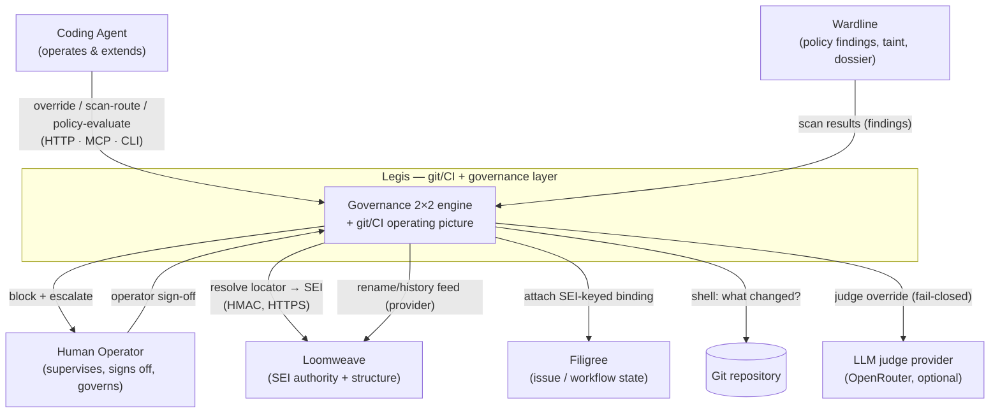
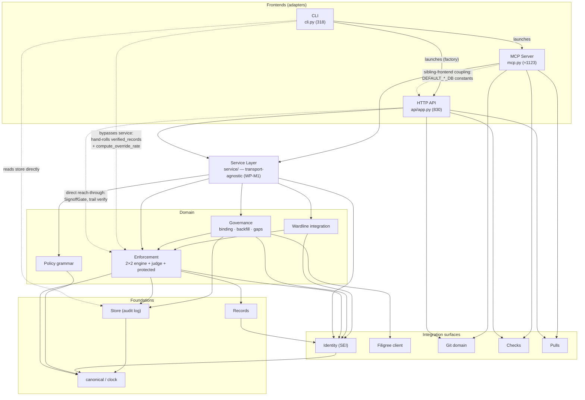
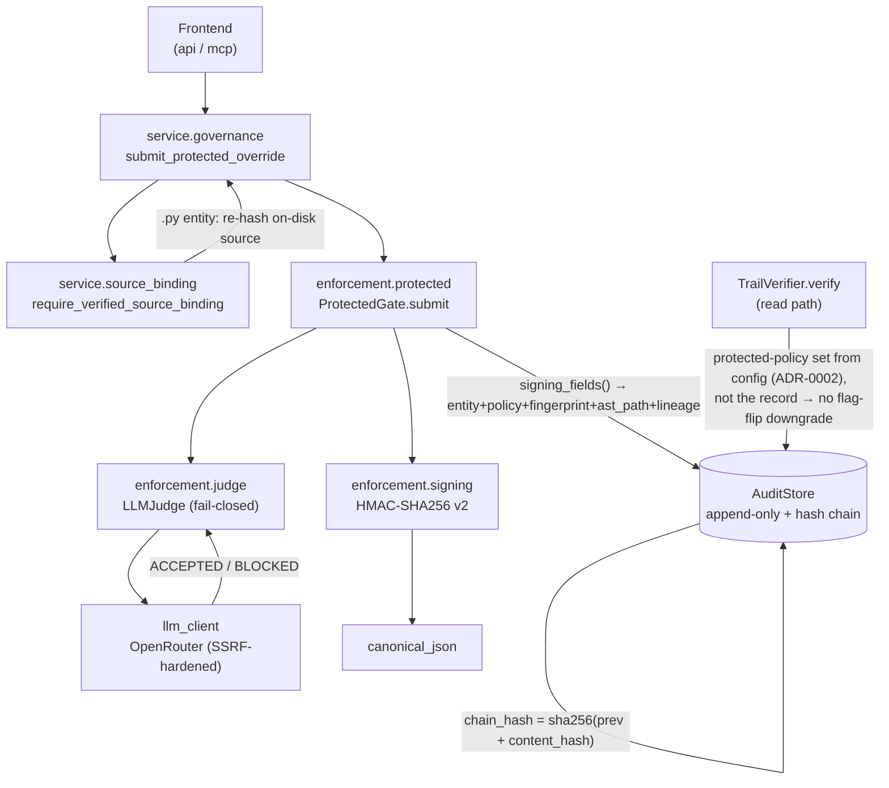
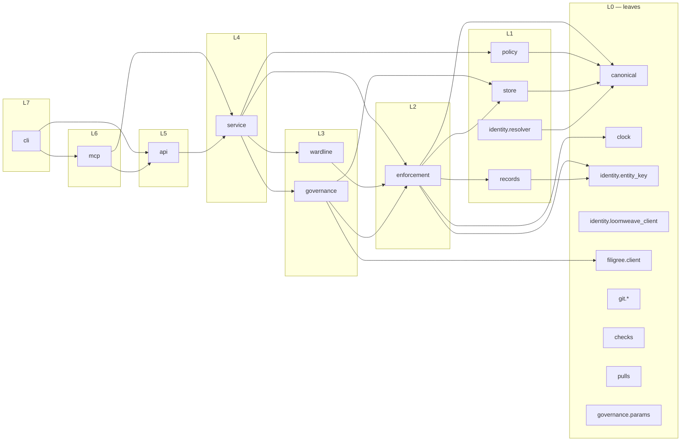
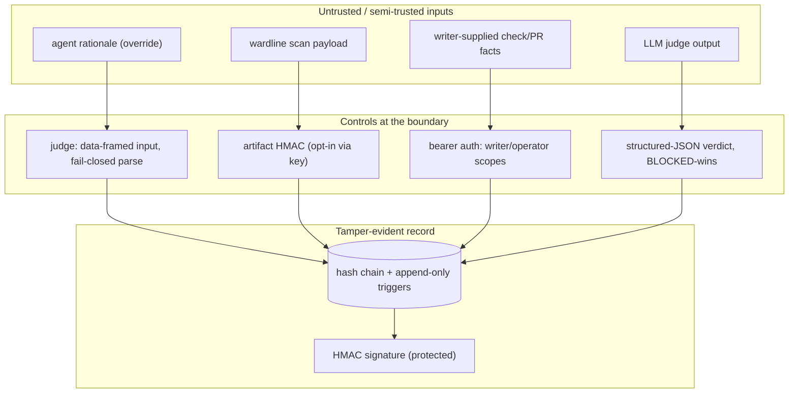

# 03 — Architecture Diagrams

C4-style views (Context → Container → Component) plus the internal dependency layering.
All edges are derived from the `file:line` import evidence collected in the cluster passes
(`temp/catalog-*.md`). Rendered as Mermaid.

---

## Level 1 — System Context

Legis inside the Weft suite. Legis governs *change* and consumes the other tools' authorities.

**Key boundary facts:** Legis is an SEI *consumer* (treats SEI as opaque). Loomweave traffic is
HMAC-signed over HTTPS; **Filigree traffic is unsigned** (app-level attestation only). Wardline
findings are *produced* by Wardline and *routed to cells* by Legis ("one judge, not two").

---

## Level 2 — Container (frontends → service → domain → foundations)

Three frontends are *intended* to converge on one transport-agnostic service layer. Solid edges
follow that intent; **dashed red edges are the drift** where a frontend bypasses or cross-couples.

> The dashed red edges are the report's central architectural finding: **the service layer is a
> partial seam.** It owns governance decisions cleanly for `api` and `mcp`, but `api` reaches past
> it for sign-off, `cli` doesn't use it at all, and `mcp` couples to `api` for shared constants.

---

## Level 3 — Component: the Protected cell (the "full machinery")

The most security-critical path — a protected override from submission to tamper-evident record.

**Invariants enforced on this path:** judge fails closed (BLOCKED on ambiguity / no provider);
every protected record is HMAC-signed via the *same* `signing_fields()` the verifier reads (signer/verifier
can't drift); the protected-policy set is config-owned so a record can't declare itself unprotected.
**Known gap on this path:** a non-`.py` entity passes source binding as `unverified` yet still gets
signed (M1); `verify_integrity` can raise instead of returning `False` on non-finite-float tampering (M6).

---

## Internal dependency layering (the DAG)

No import cycles exist. Modules form a clean DAG; the layer index is the longest path to a leaf.

**Layer-violation notes (not cycles, but smells):**
- `mcp (L6) -> api (L5)` — a frontend depends on a sibling frontend for shared DB-default constants. The only cross-frontend static edge; should resolve to a shared config module.
- `cli (L7) -> api/mcp` — launcher edges (acceptable), but `cli` also reaches `enforcement (L2)`/`store (L1)` directly, skipping `service (L4)`.
- `api (L5) -> enforcement (L2)` — direct reach-through for sign-off, skipping its own `service (L4)`.

---

## Trust-boundary map

**Residual boundary weaknesses (carried to 05):** writer/operator split is vacuous in single-secret
mode; check/PR facts are recorded on the writer's word (no fact provenance); Filigree transport is
unsigned; LLM judge output is parsed as gate authority (prompt-injection surface in coached/protected).
